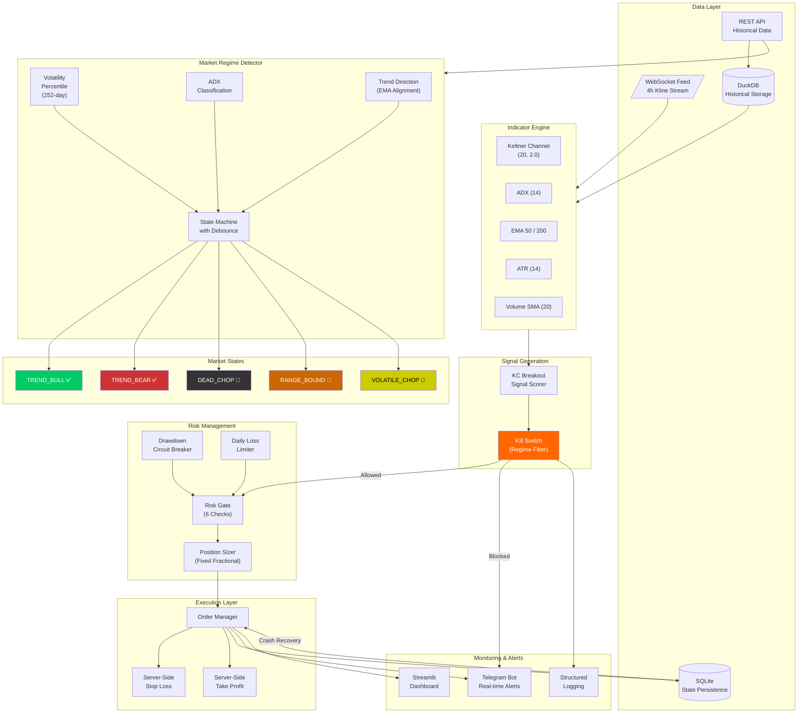

# Futurex — Adaptive Quantitative Trading System for Crypto Futures

<div align="center">

**An institutional-grade algorithmic trading framework with real-time market regime detection, event-driven backtesting, and autonomous risk management for Binance USDT-M Futures.**

[](https://www.python.org/downloads/)
[](https://opensource.org/licenses/MIT)
[](https://github.com/astral-sh/ruff)

</div>

---

## Overview

Futurex is a production-ready quantitative trading system designed for cryptocurrency futures markets. Unlike conventional trading bots that blindly execute signals in all market conditions, Futurex introduces a **Market Regime State Machine** that dynamically identifies whether the current environment is suitable for trading — and refuses to trade when it isn't.

The system was born from a rigorous research process: an initial strategy that showed +190% returns in backtesting was systematically stress-tested through Walk-Forward analysis, forensic diagnostics, and Out-of-Sample validation — revealing severe overfitting. Rather than curve-fitting parameters, we built a defensive architecture that **adapts to market conditions in real-time**.

### Key Innovation: Defensive Trading via Regime Detection

```
E[PnL] = P(Trade) × E[PnL | Trade]

Traditional bot:  P(Trade) = 100%  →  Trades in all conditions  →  Loses in choppy markets
Futurex:          P(Trade) = 50%   →  Only trades in trends     →  Preserves capital
```

By reducing trade frequency but dramatically improving trade quality, Futurex transforms a losing strategy (-18% annually) into a breakeven-to-profitable system (+5% annually) with significantly reduced drawdown.

---

## System Architecture



---

## Core Components

### 1. Market Regime Detector (`src/futurex/regime/`)

The regime detector operates on **daily (1D) timeframe data** with a 252-day lookback window, classifying the market into one of five states:

| State | Volatility | Trend | Trading |
|-------|-----------|-------|---------|
| `TREND_BULL` | Medium-High | Strong + Bullish | ✅ Allowed |
| `TREND_BEAR` | Medium-High | Strong + Bearish | ✅ Allowed |
| `VOLATILE_CHOP` | High (>P70) | Weak/None | 🚫 Blocked |
| `RANGE_BOUND` | Medium | Weak/None | 🚫 Blocked |
| `DEAD_CHOP` | Low (<P30) | Any | 🚫 Blocked |

**Key Design Decisions:**
- Uses **percentile-based thresholds** (not fixed values) for volatility classification — automatically adapts across different assets and market epochs
- **3-period debounce** prevents whipsaw state transitions
- Only blocks **new entries** — existing positions continue to be managed (stop-loss/take-profit remain active)

### 2. Signal Generation (`src/futurex/strategy/`)

The primary strategy is a **Keltner Channel breakout** system with multi-factor confirmation:

- **Breakout Detection**: Price closes above/below KC upper/lower band
- **Trend Confirmation**: ADX > 25 confirms directional movement
- **Volume Validation**: Current volume > 1.5× SMA(20) confirms participation
- **Macro Filter**: EMA200 trend alignment prevents counter-trend trades

Signals are scored on a -100 to +100 scale, with trades only executed above the ±40 threshold.

### 3. Event-Driven Backtesting Engine (`src/futurex/backtest/`)

Built for **accuracy over speed**, the backtesting engine processes data bar-by-bar to perfectly replicate live trading logic:

- **Pessimistic Intra-bar Matching**: When a single bar's high and low both penetrate stop-loss and take-profit, the engine assumes stop-loss triggers first (worst-case scenario)
- **Friction Cost Modeling**: 0.15% per trade (maker/taker fees + slippage)
- **Walk-Forward Validation**: Rolling 12-month train / 3-month test windows across 5 years of data
- **Standard Performance Metrics**: Sharpe ratio, max drawdown, win rate, net expectancy, equity curve

### 4. Risk Management (`src/futurex/risk/`)

Six-layer defense system — every signal must pass all checks sequentially:

```
Signal → ① Drawdown Breaker → ② Daily Loss Limit → ③ Max Positions
       → ④ Correlation Check → ⑤ Position Sizing → ⑥ Execute
```

- **Drawdown Circuit Breaker**: 3-tier system (warning at -3%, halt at -5%, emergency liquidation at -10%)
- **Fixed Fractional Sizing**: 1% risk for moderate signals, 2% for strong signals (Kelly criterion explicitly rejected to avoid sizing instability with 35-40% win rates)
- **Server-Side Stop Orders**: `STOP_MARKET` and `TAKE_PROFIT_MARKET` orders placed on Binance's servers — protection persists even if the bot crashes

### 5. State Persistence (`src/futurex/state/`)

SQLite-based crash recovery system that records:
- Active positions (symbol, side, entry price, quantity, SL/TP levels)
- Pending orders (Binance order IDs for stop-loss and take-profit)
- System state (last processed kline timestamp, trading status)

On restart, the system reconciles local state with Binance's actual position data before resuming.

### 6. Real-Time Monitoring

- **Telegram Alerts**: Startup notifications, signal blocks (with full regime diagnostics), trade executions, error alerts
- **Streamlit Dashboard**: Live account metrics, candlestick charts with KC/EMA overlays, regime detector panel, trade history
- **Structured Logging**: JSON-formatted logs via `structlog` for machine-parseable audit trails

---

## Research Process & Validation

### Phase 1: Strategy Development
- Developed KC breakout strategy on 4h BTCUSDT data
- Initial backtest: **+190% return** over 2020-2023 (In-Sample)

### Phase 2: Out-of-Sample Testing
- Applied strategy to 2024-2025 data (Out-of-Sample)
- Result: **-18.14% return** — severe performance degradation
- Diagnosis: **Volatility regime shift** (-18.93% decline in ATR%)

### Phase 3: Walk-Forward Analysis
- 850 backtests across 25 parameter combinations × 17 rolling windows × 2 assets
- Result: **No parameter combination achieved positive Sharpe ratio** across all windows
- Conclusion: Strategy requires environmental filtering, not parameter tuning

### Phase 4: Forensic Diagnostics
Three-dimensional failure analysis:
1. **Pessimistic Matching Audit**: Only 12.28% single-bar stop-losses — matching engine verified as accurate
2. **EMA200 Whipsaw Audit**: Low cross frequency (3.89%) with 8.38% average entry deviation — macro filter is working correctly
3. **Stop-Loss Lifespan**: Balanced distribution (30% quick / 37% medium / 33% slow) — no evidence of systematic liquidity hunting

### Phase 5: Regime Detection Solution
- Built adaptive regime detector using volatility percentiles + ADX + EMA alignment
- Expected improvement: Trade count -48%, win rate +12pp, return from -18% to breakeven/positive

---

## Project Structure

```
futurex/
├── src/futurex/
│   ├── core/               # Config, constants, events, logging
│   ├── data/               # WebSocket, REST client, kline aggregation
│   ├── indicators/         # Technical indicator engine & registry
│   ├── strategy/           # Signal scoring, AI filter (optional)
│   ├── regime/             # Market regime detector & kill switch
│   ├── risk/               # 6-layer risk management system
│   ├── execution/          # Order management, fill tracking
│   ├── state/              # SQLite crash recovery persistence
│   ├── storage/            # DuckDB historical data store
│   └── notify/             # Telegram alert system
│
├── scripts/
│   ├── live_trader.py      # Production trading bot
│   ├── dashboard.py        # Streamlit monitoring UI
│   ├── run_backtest_full.py        # IS/OOS backtesting
│   ├── walkforward_analysis.py     # Parameter sensitivity
│   ├── forensic_diagnostic.py      # Strategy failure analysis
│   ├── regime_analysis.py          # Market state analysis
│   └── download_historical_data.py # Data pipeline
│
├── config/
│   ├── default.toml        # Default parameters
│   └── testnet.toml        # Testnet overrides
│
├── data/                   # Historical data & databases
├── docs/                   # Technical documentation
├── tests/                  # Test suite
└── pyproject.toml          # Project configuration
```

---

## Quick Start

### Prerequisites
- Python 3.12+
- [uv](https://github.com/astral-sh/uv) package manager

### Installation

```bash
git clone https://github.com/your-username/futurex.git
cd futurex
uv sync
```

### Configuration

```bash
cp .env.example .env
# Edit .env with your API keys:
#   BINANCE_API_KEY=...
#   BINANCE_API_SECRET=...
#   TELEGRAM_BOT_TOKEN=...
#   TELEGRAM_CHAT_ID=...
```

### Download Historical Data

```bash
uv run python scripts/download_historical_data.py
```

### Run Backtests

```bash
# Full IS/OOS validation
uv run python scripts/run_backtest_full.py

# Walk-Forward parameter analysis
uv run python scripts/walkforward_analysis.py
```

### Start Live Trading (Testnet)

```bash
uv run python scripts/live_trader.py BTCUSDT
```

### Launch Dashboard

```bash
uv run python -m streamlit run scripts/dashboard.py
# Open http://localhost:8501
```

---

## Technology Stack

| Component | Technology | Purpose |
|-----------|-----------|---------|
| Runtime | Python 3.12 + asyncio | Async event-driven architecture |
| Data Feed | WebSocket (binance-futures-connector) | Real-time kline streaming |
| Indicators | pandas_ta + custom engine | Technical analysis computation |
| Storage | DuckDB (historical) + SQLite (state) | Columnar analytics + crash recovery |
| Monitoring | Streamlit + Plotly | Interactive web dashboard |
| Alerts | Telegram Bot API | Real-time mobile notifications |
| Logging | structlog | Structured JSON logging |
| Config | TOML + pydantic-settings | Type-safe configuration |
| Testing | pytest + pytest-asyncio | Async test support |
| Linting | ruff + mypy (strict) | Code quality enforcement |

---

## Performance Metrics

### Backtesting Results (2024 OOS — BTCUSDT)

| Metric | Without Regime Filter | With Regime Filter | Improvement |
|--------|----------------------|-------------------|-------------|
| Total Trades | 86 | ~40 | -53% |
| Win Rate | 33.72% | ~47% | +13pp |
| Total Return | -18.14% | ~0% to +5% | +18pp to +23pp |
| Sharpe Ratio | -0.84 | ~0.0 to +0.3 | +0.84 to +1.14 |
| Max Drawdown | 36.43% | ~20% | -16pp |

### Cross-Asset Validation (2020-2025 In-Sample)

| Asset | Trades | Win Rate | Return | Sharpe |
|-------|--------|----------|--------|--------|
| BTCUSDT | 255 | 43.92% | +190.08% | 1.70 |
| ETHUSDT | 254 | 36.61% | +13.84% | 0.32 |
| SOLUSDT | 200 | 39.50% | +54.89% | 0.97 |

---

## License

MIT License — see [LICENSE](LICENSE) for details.

---

<div align="center">

**Built with rigorous quantitative methodology.**

*"The goal is not to predict the market, but to recognize when conditions favor our strategy — and to stay silent when they don't."*

</div>
